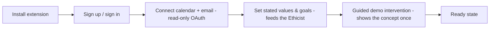
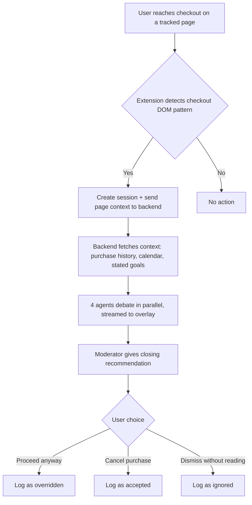
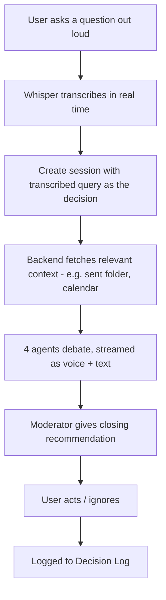
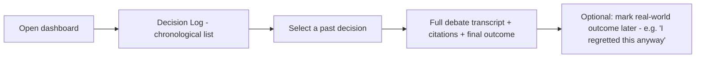

# DIALECTA — App Flow

## 1. Onboarding Flow

Goals captured at onboarding (e.g. "saving for a trip," "no impulse buys over ₹2000," "be direct but kind in emails") are stored as `user_values` and are what the Ethicist agent checks decisions against (see `BACKEND_SCHEMA.md` §2).

## 2. Core Flow: Browser Checkout Intercept

## 3. Core Flow: Voice Query Debate

## 4. Core Flow: Decision Log Review

The optional outcome-tagging step is what eventually lets DIALECTA calibrate which agent's read was most often right for a given user — a natural post-hackathon feature, not required for MVP.

## 5. Settings Flow

- **Connected accounts** — view/revoke calendar & email connections.
- **Agent tuning** — adjust how aggressive the Skeptic is, how cautious the Ethicist is (slider, stored per-user).
- **Stated goals/values** — edit the text the Ethicist checks decisions against.

## 6. Error / Edge Case Flows

| Case | Behavior |
|---|---|
| LLM call times out mid-debate | Show "this agent is taking longer than expected" inline, don't block the other 3 agents' output |
| MCP returns no relevant context | Agents explicitly state "no relevant history found" rather than inventing one |
| User dismisses without reading | Logged as `ignored` — still valuable signal, not treated as an error |
| User has not connected calendar/email | Agents proceed on general reasoning only, with a visible "limited context" badge on the overlay |
