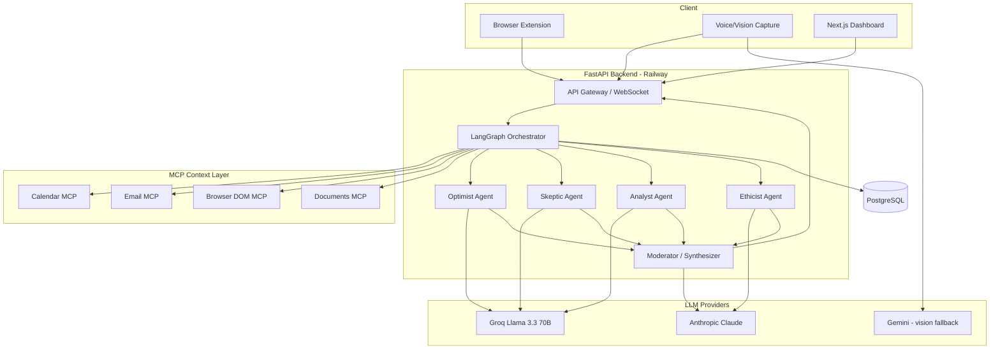
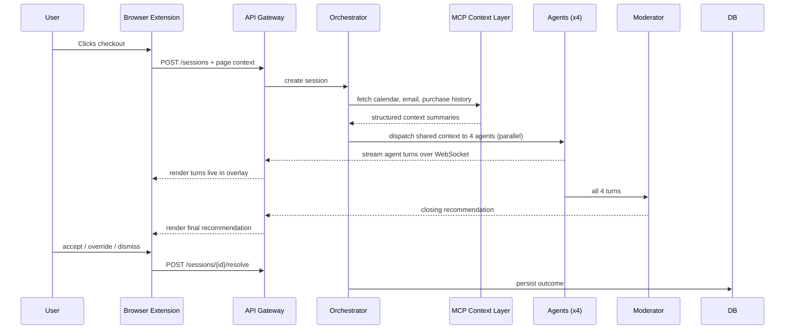

# DIALECTA — System Architecture

## 1. High-Level Diagram



## 2. Component Breakdown

| Component | Responsibility |
|---|---|
| Browser Extension | Detects checkout/send-like DOM events, renders the intervention overlay, sends page context to the gateway |
| Voice/Vision Capture | Streams microphone audio (Whisper) and optional screenshot context |
| API Gateway | REST endpoints for session lifecycle + WebSocket for live streaming |
| LangGraph Orchestrator | Coordinates the state machine: context fetch → parallel debate → synthesis |
| Agent Nodes | The 4 personas; each is an independent LLM call with a shared context payload and a distinct system prompt (see `AI_INSTRUCTIONS.md`) |
| Moderator | Reads all 4 agent outputs, resolves them into one closing recommendation |
| MCP Context Layer | The *only* components with raw provider access (Google Calendar/Gmail tokens, page DOM); returns pre-summarized, structured context — never raw payloads — to the orchestrator |
| PostgreSQL | Persists sessions, debate turns (summarized), decisions, user goals |

## 3. Orchestration State Machine (LangGraph)

```
Intake
  → Context Fetch (parallel MCP calls: calendar, email, DOM, documents)
  → Parallel Agent Debate (Optimist, Skeptic, Analyst, Ethicist run concurrently on shared context)
  → Cross-Examination (optional second pass: each agent sees the other three's first turn once)
  → Moderator Synthesis (single closing recommendation)
  → Stream to Client + Persist to DB
```

The Cross-Examination step is what makes this an *adversarial* system rather than four independent opinions — it's the one round where agents are shown each other's reasoning and can react to it before the Moderator closes the debate. For the 48h MVP, this step can be cut first if time is tight; the four parallel takes plus a Moderator synthesis is still a complete, demoable loop.

## 4. Sequence Diagram — One Intervention



## 5. Data Privacy Boundary

The MCP Context Layer is a hard boundary: it is the only part of the system that ever holds an OAuth token or touches a raw calendar event or email body. It returns **structured, minimal summaries** (e.g. `{"type": "purchase_pattern", "detail": "3 similar items bought in last 30 days, all unused"}`) to the orchestrator — never raw payloads. This means:

- A prompt-injection in an email body can't reach the agent's system prompt directly; the MCP layer summarizes before handoff.
- Nothing raw is ever logged in the debate transcript stored in PostgreSQL — only the structured citation.

## 6. Scalability Notes (post-hackathon, not required for MVP)

- Move agent dispatch behind a queue (Redis + worker pool) once concurrent sessions exceed a single Railway instance's comfortable load.
- Multi-tenant isolation: per-user encryption keys for connector tokens, row-level security in Postgres.
- Consider a local/edge model (Ollama + Llama 3.x) for the MCP summarization step itself, so raw provider data never leaves the user's device before being summarized.
