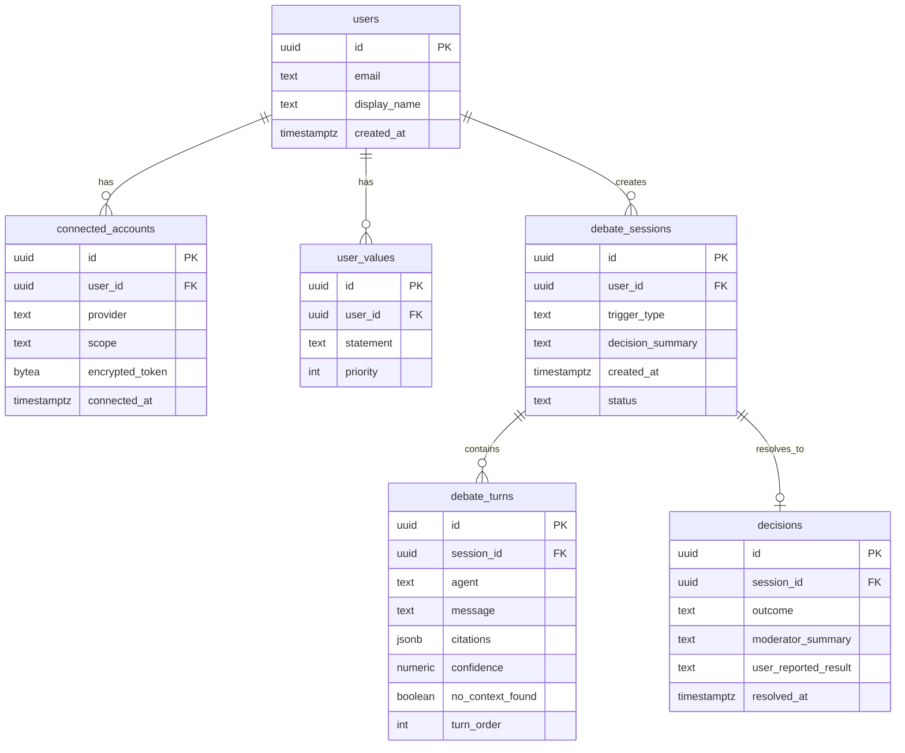

# DIALECTA — Backend Schema

## 1. ERD Overview



## 2. Tables (SQL)

```sql
CREATE TABLE users (
    id UUID PRIMARY KEY DEFAULT gen_random_uuid(),
    email TEXT UNIQUE NOT NULL,
    display_name TEXT,
    created_at TIMESTAMPTZ NOT NULL DEFAULT now()
);

CREATE TABLE connected_accounts (
    id UUID PRIMARY KEY DEFAULT gen_random_uuid(),
    user_id UUID NOT NULL REFERENCES users(id) ON DELETE CASCADE,
    provider TEXT NOT NULL CHECK (provider IN ('google_calendar', 'gmail')),
    scope TEXT NOT NULL,                 -- e.g. 'readonly'
    encrypted_token BYTEA NOT NULL,      -- encrypted with TOKEN_ENCRYPTION_KEY, never raw
    connected_at TIMESTAMPTZ NOT NULL DEFAULT now(),
    UNIQUE (user_id, provider)
);

CREATE TABLE user_values (
    id UUID PRIMARY KEY DEFAULT gen_random_uuid(),
    user_id UUID NOT NULL REFERENCES users(id) ON DELETE CASCADE,
    statement TEXT NOT NULL,             -- e.g. "saving for a trip, no impulse buys over 2000"
    priority INT NOT NULL DEFAULT 0,     -- ordering for the Ethicist's weighting
    created_at TIMESTAMPTZ NOT NULL DEFAULT now()
);

CREATE TABLE debate_sessions (
    id UUID PRIMARY KEY DEFAULT gen_random_uuid(),
    user_id UUID NOT NULL REFERENCES users(id) ON DELETE CASCADE,
    trigger_type TEXT NOT NULL CHECK (trigger_type IN ('checkout', 'voice', 'manual')),
    decision_summary TEXT NOT NULL,      -- short human-readable description of the decision
    status TEXT NOT NULL DEFAULT 'in_progress'
        CHECK (status IN ('in_progress', 'completed', 'failed')),
    created_at TIMESTAMPTZ NOT NULL DEFAULT now()
);

CREATE TABLE debate_turns (
    id UUID PRIMARY KEY DEFAULT gen_random_uuid(),
    session_id UUID NOT NULL REFERENCES debate_sessions(id) ON DELETE CASCADE,
    agent TEXT NOT NULL CHECK (agent IN ('optimist', 'skeptic', 'analyst', 'ethicist', 'moderator')),
    message TEXT NOT NULL,
    citations JSONB NOT NULL DEFAULT '[]',   -- [{ "source": "...", "detail": "..." }]
    confidence NUMERIC(3,2),
    no_context_found BOOLEAN NOT NULL DEFAULT false,
    turn_order INT NOT NULL,
    created_at TIMESTAMPTZ NOT NULL DEFAULT now()
);

CREATE TABLE decisions (
    id UUID PRIMARY KEY DEFAULT gen_random_uuid(),
    session_id UUID NOT NULL UNIQUE REFERENCES debate_sessions(id) ON DELETE CASCADE,
    outcome TEXT NOT NULL CHECK (outcome IN ('accepted', 'overridden', 'ignored')),
    moderator_summary TEXT,
    user_reported_result TEXT,           -- optional, filled in later from Decision Log review
    resolved_at TIMESTAMPTZ NOT NULL DEFAULT now()
);
```

## 3. Indexes & Constraints

```sql
CREATE INDEX idx_debate_turns_session ON debate_turns (session_id, turn_order);
CREATE INDEX idx_sessions_user_created ON debate_sessions (user_id, created_at DESC);
CREATE INDEX idx_connected_accounts_user ON connected_accounts (user_id);
```

- `connected_accounts.encrypted_token` is encrypted at the application layer (Fernet/AES-GCM with `TOKEN_ENCRYPTION_KEY`) before insert — Postgres never stores a plaintext OAuth token.
- `debate_turns.citations` stores only structured summaries (source + short detail string) — never raw email bodies or full calendar event payloads. This mirrors the privacy boundary described in `ARCHITECTURE.md` §5.
- `debate_sessions.decision_summary` is a short string generated at session creation (e.g. from the page title or the transcribed voice query) — not a copy of any third-party content.

## 4. Notes on Token Handling

- Tokens are decrypted only inside the MCP Context Layer process, immediately before a provider API call, and never logged.
- On account disconnect, the row in `connected_accounts` is deleted, not soft-deleted — there's no reason to retain a revoked token.
